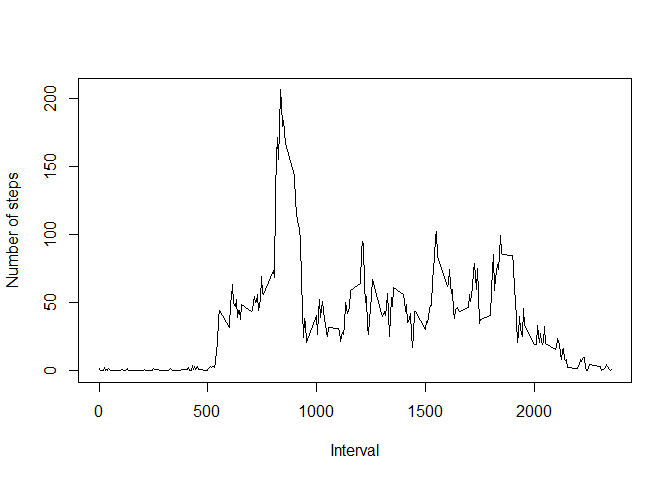

## Loading and preprocessing the data
First, the data is loaded and the dates were chnaged into data fromat from strings using the "as.Date" function


```r
df<- read.csv("activity.csv", na.strings = "NA")
df$date <- as.Date(df$date, "%Y-%m-%d")
```


## What is mean total number of steps taken per day?
Second, the mean and median for steps taken by day were taken. That was performed by using the "tapply" function on the steps per day, then using this yo get the mean and the median of the data. Also the histogram of the number of steps is drawn.


```r
tot_steps<- tapply(df$steps, df$date, sum)
hist(tot_steps, xlab="Total Steps", main= "Histogram of the total number of steps taken each day")
```

<!-- -->

```r
mean(tot_steps, na.rm = TRUE)
```

```
## [1] 10766.19
```

```r
median(tot_steps, na.rm = TRUE)
```

```
## [1] 10765
```


## What is the average daily activity pattern?

Third, the mean for each interval is calculated and then plotted as time series plot.


```r
t<- tapply(df$steps, df$interval, mean, na.rm=TRUE)
plot(x=df$interval[1:288],y=t, type="l", xlab="Interval",ylab="Number of steps")
```

<!-- -->

The interval which on average, contains the maximum number of steps:


```r
df$interval[which.max(t)[1]]
```

```
## [1] 835
```

## Imputing missing values

The number of missing values were calculated

```r
sum(is.na(df$steps))
```

```
## [1] 2304
```

For imputing the missing values,the data frame was saved in a new data frame, the a for loop was used.
The for loop basically loops on the data frame, if it finds a number of steps missing, then it goes to the array "t" which has the averages for each interval and then replace the missing number of steps

```r
new_df<- df
for (i in seq_along(new_df$steps)) {if (is.na(new_df$steps[i])) new_df$steps[i]<- t[as.character(new_df$interval[i])]}
```
A new histogram of the total number of steps taken each day after missing values are imputed


```r
tot_steps2<- tapply(new_df$steps, new_df$date, sum)
hist(tot_steps2, xlab="Total Steps", main= "Histogram of the total number of steps taken each day")
```

<!-- -->

The new mean and median of the new data frame:

```r
mean(tot_steps2)
```

```
## [1] 10766.19
```

```r
median(tot_steps2)
```

```
## [1] 10766.19
```


## Are there differences in activity patterns between weekdays and weekends?
Finally, to get the differences in activity patterns by weekend and weekday, a factor variable was first created to split the days into weekdays and weekends. Then two subsets of the data frame were created, one for weekend and one for weekday.

```r
new_df$wkday<- weekdays(new_df$date)
wkend<- c('Saturday','Sunday')
new_df$daytype<- factor((weekdays(new_df$date) %in% wkend),levels = c(TRUE,FALSE),labels=c('weekend', 'weekday'))
new_df_wd <- subset(new_df,new_df$daytype=="weekday")
new_df_we <- subset(new_df,new_df$daytype=="weekend")
```

The means were calculated for each interval for both weekdays and weekends, then a plot was created to show both results

```r
mean_wd<- tapply(new_df_wd$steps, new_df_wd$interval, mean)
mean_we<- tapply(new_df_we$steps, new_df_we$interval, mean)
par(mfrow=c(2,1),mar=c(4,4,2,2))
with(new_df_we,plot(new_df$interval[1:288],mean_we, type='l', xlab="Interval",ylab="Number of steps", main= 'weekend'))
with(new_df_wd,plot(new_df$interval[1:288],mean_wd, type='l', xlab="Interval",ylab="Number of steps", main= 'weekday'))
```

<!-- -->

